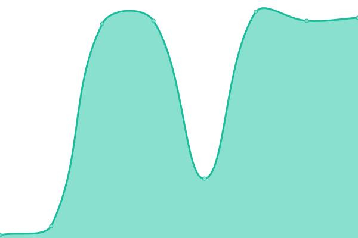
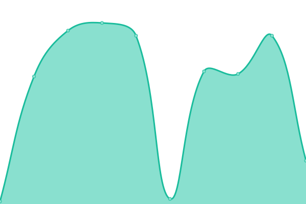
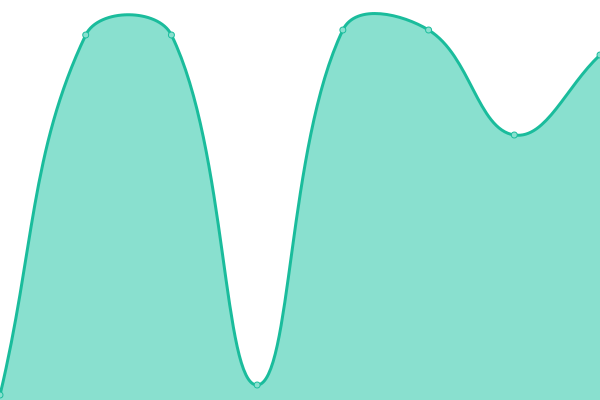
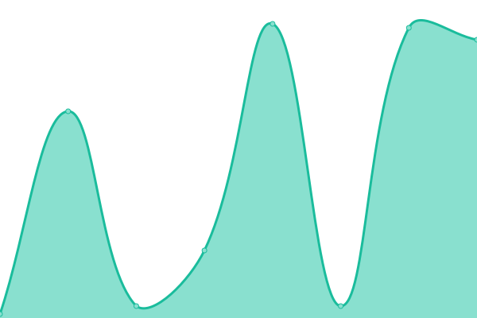
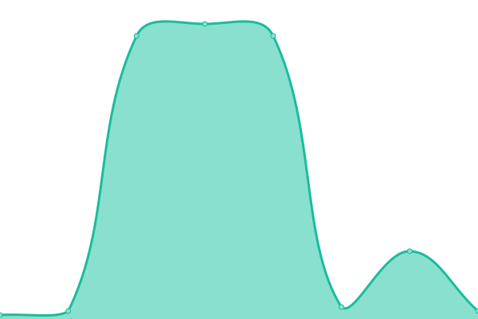

# [📈 Live Status](https://ettelabsinc.github.io/ette-uptimejs): <!--live status--> **🟧 Partial outage**

This repository contains the open-source uptime monitor and status page for [ettelabsinc](https://ettelabsinc.github.io/ette-uptimejs), powered by [Upptime](https://github.com/upptime/upptime).

With [Upptime](https://upptime.js.org), you can get your own unlimited and free uptime monitor and status page, powered entirely by a GitHub repository. We use [Issues](https://github.com/ettelabsinc/ette-uptimejs/issues) as incident reports, [Actions](https://github.com/ettelabsinc/ette-uptimejs/actions) as uptime monitors, and [Pages](https://ettelabsinc.github.io/ette-uptimejs) for the status page.

<!--start: status pages-->
<!-- This summary is generated by Upptime (https://github.com/upptime/upptime) -->
<!-- Do not edit this manually, your changes will be overwritten -->
<!-- prettier-ignore -->
| URL | Status | History | Response Time | Uptime |
| --- | ------ | ------- | ------------- | ------ |
|  [demo-web.prod (IPv4, HTTPS)](https://demo-web.prod.dashphone.app) | 🟩 Up | [demo-web-prod-i-pv4-https.yml](https://github.com/ettelabsinc/ette-uptimejs/commits/HEAD/history/demo-web-prod-i-pv4-https.yml) | 

 665ms
     
 | 

<a href="https://ettelabsinc.github.io/ette-uptimejs/history/demo-web-prod-i-pv4-https">100.00%</a>
    

|  [demo-web.prod (IPv6, HTTPS)](https://demo-web.prod.dashphone.app) | 🟩 Up | [demo-web-prod-i-pv6-https.yml](https://github.com/ettelabsinc/ette-uptimejs/commits/HEAD/history/demo-web-prod-i-pv6-https.yml) | 

 205ms
     
 | 

<a href="https://ettelabsinc.github.io/ette-uptimejs/history/demo-web-prod-i-pv6-https">100.00%</a>
    

|  [demo-web.staging (IPv4, HTTPS)](https://stagingapp.dashphone.app) | 🟥 Down | [demo-web-staging-i-pv4-https.yml](https://github.com/ettelabsinc/ette-uptimejs/commits/HEAD/history/demo-web-staging-i-pv4-https.yml) | 

 0ms
     
 | 

<a href="https://ettelabsinc.github.io/ette-uptimejs/history/demo-web-staging-i-pv4-https">0.00%</a>
    

|  [demo-web.staging (IPv6, HTTPS)](https://stagingapp.dashphone.app) | 🟥 Down | [demo-web-staging-i-pv6-https.yml](https://github.com/ettelabsinc/ette-uptimejs/commits/HEAD/history/demo-web-staging-i-pv6-https.yml) | 

 0ms
     
 | 

<a href="https://ettelabsinc.github.io/ette-uptimejs/history/demo-web-staging-i-pv6-https">0.00%</a>
    

|  [sip1.demo.prod (IPv4, HTTPS)](https://sip1.demo.prod.dashphone.app/metrics) | 🟩 Up | [sip1-demo-prod-i-pv4-https.yml](https://github.com/ettelabsinc/ette-uptimejs/commits/HEAD/history/sip1-demo-prod-i-pv4-https.yml) | 

 318ms
     
 | 

<a href="https://ettelabsinc.github.io/ette-uptimejs/history/sip1-demo-prod-i-pv4-https">100.00%</a>
    

|  [sip1.demo.prod (IPv6, HTTPS)](https://sip1.demo.prod.dashphone.app/metrics) | 🟩 Up | [sip1-demo-prod-i-pv6-https.yml](https://github.com/ettelabsinc/ette-uptimejs/commits/HEAD/history/sip1-demo-prod-i-pv6-https.yml) | 

 43ms
     
 | 

<a href="https://ettelabsinc.github.io/ette-uptimejs/history/sip1-demo-prod-i-pv6-https">100.00%</a>
    

|  [sip1.demo.staging (IPv4, HTTPS)](https://sip1.demo.staging.dashphone.app/metrics) | 🟩 Up | [sip1-demo-staging-i-pv4-https.yml](https://github.com/ettelabsinc/ette-uptimejs/commits/HEAD/history/sip1-demo-staging-i-pv4-https.yml) | 

 311ms
     
 | 

<a href="https://ettelabsinc.github.io/ette-uptimejs/history/sip1-demo-staging-i-pv4-https">100.00%</a>
    

|  [sip1.demo.staging (IPv6, HTTPS)](https://sip1.demo.staging.dashphone.app/metrics) | 🟩 Up | [sip1-demo-staging-i-pv6-https.yml](https://github.com/ettelabsinc/ette-uptimejs/commits/HEAD/history/sip1-demo-staging-i-pv6-https.yml) | 

 44ms
     
 | 

<a href="https://ettelabsinc.github.io/ette-uptimejs/history/sip1-demo-staging-i-pv6-https">100.00%</a>
    

|  [sip1.demo.prod (IPv4, 5060/TCP)](sip1.demo.prod.dashphone.app) | 🟩 Up | [sip1-demo-prod-i-pv4-5060-tcp.yml](https://github.com/ettelabsinc/ette-uptimejs/commits/HEAD/history/sip1-demo-prod-i-pv4-5060-tcp.yml) | 

 42ms
     
 | 

<a href="https://ettelabsinc.github.io/ette-uptimejs/history/sip1-demo-prod-i-pv4-5060-tcp">100.00%</a>
    

|  [sip1.demo.staging (IPv4, 5060/TCP)](sip1.demo.staging.dashphone.app) | 🟩 Up | [sip1-demo-staging-i-pv4-5060-tcp.yml](https://github.com/ettelabsinc/ette-uptimejs/commits/HEAD/history/sip1-demo-staging-i-pv4-5060-tcp.yml) | 

 41ms
     
 | 

<a href="https://ettelabsinc.github.io/ette-uptimejs/history/sip1-demo-staging-i-pv4-5060-tcp">100.00%</a>
    

|  [fs1.demo.prod (IPv4, 5070/TCP)](fs1.demo.prod.dashphone.app) | 🟩 Up | [fs1-demo-prod-i-pv4-5070-tcp.yml](https://github.com/ettelabsinc/ette-uptimejs/commits/HEAD/history/fs1-demo-prod-i-pv4-5070-tcp.yml) | 

 42ms
     
 | 

<a href="https://ettelabsinc.github.io/ette-uptimejs/history/fs1-demo-prod-i-pv4-5070-tcp">100.00%</a>
    

|  [fs1.demo.staging (IPv4, 5070/TCP)](fs1.demo.staging.dashphone.app) | 🟩 Up | [fs1-demo-staging-i-pv4-5070-tcp.yml](https://github.com/ettelabsinc/ette-uptimejs/commits/HEAD/history/fs1-demo-staging-i-pv4-5070-tcp.yml) | 

 42ms
     
 | 

<a href="https://ettelabsinc.github.io/ette-uptimejs/history/fs1-demo-staging-i-pv4-5070-tcp">100.00%</a>
    

|  [cr1.prod (IPv4, 5060/TCP)](cr1.prod.ettelabs.com) | 🟩 Up | [cr1-prod-i-pv4-5060-tcp.yml](https://github.com/ettelabsinc/ette-uptimejs/commits/HEAD/history/cr1-prod-i-pv4-5060-tcp.yml) | 

 41ms
     
 | 

<a href="https://ettelabsinc.github.io/ette-uptimejs/history/cr1-prod-i-pv4-5060-tcp">100.00%</a>
    

|  [cr2.prod (IPv4, 5060/TCP)](cr2.prod.ettelabs.com) | 🟩 Up | [cr2-prod-i-pv4-5060-tcp.yml](https://github.com/ettelabsinc/ette-uptimejs/commits/HEAD/history/cr2-prod-i-pv4-5060-tcp.yml) | 

 41ms
     
 | 

<a href="https://ettelabsinc.github.io/ette-uptimejs/history/cr2-prod-i-pv4-5060-tcp">100.00%</a>
    

|  [cr1.staging (IPv4, 5060/TCP)](cr1.staging.ettelabs.com) | 🟥 Down | [cr1-staging-i-pv4-5060-tcp.yml](https://github.com/ettelabsinc/ette-uptimejs/commits/HEAD/history/cr1-staging-i-pv4-5060-tcp.yml) | 

 12ms
     
 | 

<a href="https://ettelabsinc.github.io/ette-uptimejs/history/cr1-staging-i-pv4-5060-tcp">86.62%</a>
    

|  [cr2.staging (IPv4, 5060/TCP)](cr2.staging.ettelabs.com) | 🟩 Up | [cr2-staging-i-pv4-5060-tcp.yml](https://github.com/ettelabsinc/ette-uptimejs/commits/HEAD/history/cr2-staging-i-pv4-5060-tcp.yml) | 

 41ms
     
 | 

<a href="https://ettelabsinc.github.io/ette-uptimejs/history/cr2-staging-i-pv4-5060-tcp">100.00%</a>
    

<!--end: status pages-->

[**Visit our status website →**](https://ettelabsinc.github.io/ette-uptimejs)

## 📄 License

- Powered by: [Upptime](https://github.com/upptime/upptime)
- Code: [MIT](./LICENSE) © [Anand Chowdhary](https://anandchowdhary.com), supported by [Pabio](https://pabio.com)
- Data in the `./history` directory: [Open Database License](https://opendatacommons.org/licenses/odbl/1-0/)
